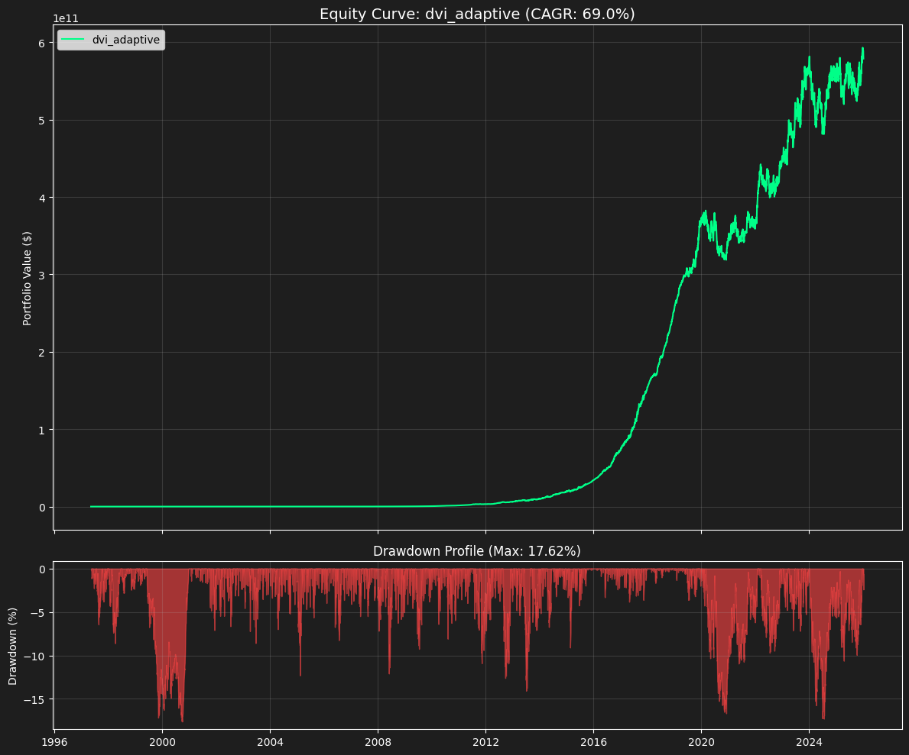

# 📊 Backtest Report: dvi_adaptive

## Performance Metrics
| Metric | Value |
|--------|-------|
| **Total Return** | `578827341.02%` |
| **CAGR** | `69.0%` |
| **Sharpe Ratio** | `3.049` |
| **Sortino Ratio** | `4.749` |
| **Max Drawdown** | `17.62%` |
| **Vol (Ann.)** | `16.35%` |

## Risk Profile
- **Calmar Ratio**: 3.917
- **Win Rate**: 60.81%
- **VaR (95%)**: -1.46%
- **Longest DD**: 506 days

_Generated automatically by DevalShield Backtester_
    